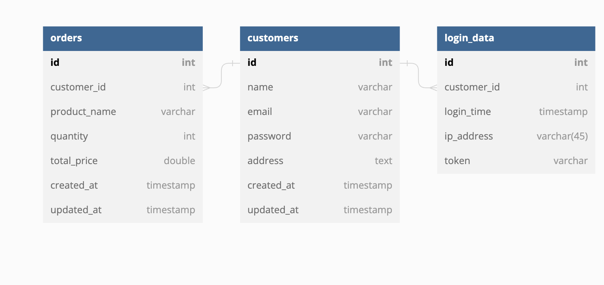

## Important

### Please make sure to change the docker-compose.yaml environment is suitable to your environment (no need .env file)

### If you want to run the program without docker please create .env file with the example below:
PORT=8090
DB_HOST=localhost
DB_USER=postgres
DB_PASSWORD=postgres
DB_NAME=postgres
DB_PORT=5432
JWT_SECRET_KEY=3kj9dk23oi9d390oq

### You can get the query to create the tables on tables.sql and make sure to migrate the tables

## Database Schema

### Customers

- Table Name: customers

| Column Name | Data Type    | Constraints        | Description              |
|-------------|--------------|--------------------|--------------------------|
| id          | serial       | Primary Key        | Unique ID for the customer |
| name        | varchar(255) | Not Null           | Name of the customer     |
| email       | varchar(255) | Not Null, Unique   | Email of the customer    |
| password    | varchar(255) | Not Null           | Password of the customer |
| address     | text         |                    | Address of the customer  |
| created_at  | timestamptz  | Auto-generated     | Creation timestamp       |
| updated_at  | timestamptz  | Auto-generated     | Last update timestamp    |

### Orders

- Table Name: orders

| Column Name | Data Type       | Constraints        | Description                     |
|-------------|-----------------|--------------------|---------------------------------|
| id          | serial          | Primary Key        | Unique ID for the order         |
| customer_id | bigint          | Not Null           | ID of the associated customer   |
| product_name| varchar(255)    | Not Null           | Name of the product             |
| quantity    | bigint          | Not Null           | Quantity of the product         |
| total_price | double precision| Not Null           | Total price of the order         |
| created_at  | timestamptz     | Auto-generated     | Creation timestamp              |
| updated_at  | timestamptz     | Auto-generated     | Last update timestamp           |

### Login Data

- Table Name: login_data

| Column Name | Data Type       | Constraints        | Description                     |
|-------------|-----------------|--------------------|---------------------------------|
| id          | serial          | Primary Key        | Unique ID for the login data     |
| customer_id | bigint          | Not Null           | ID of the associated customer    |
| login_time  | timestamptz     | Auto-generated     | Login timestamp                 |
| ip_address  | varchar(45)     |                    | IP address of the login          |
| token       | varchar(255)    | Not Null           | Token for authentication         |

## ERD Diagram

## API Endpoints

### Get list of customers

- **URL:** `/customers`
- **Method:** `GET`
- **Description:** Get a list of all customers.
- **Parameters:** None
- **Response:**
  - Status Code: `200 OK`
  - Body: Array of customer objects.

### Create a new customer

- **URL:** `/customers`
- **Method:** `POST`
- **Description:** Create a new customer.
- **Parameters:** None
- **Request Body:** Customer object with the following properties:
  - name (string): Name of the customer.
  - email (string): Email of the customer.
  - password (string): Password of the customer.
  - address (string): Address of the customer.
- **Response:**
  - Status Code: `201 Created`
  - Body: The created customer object.

### Get customer details

- **URL:** `/customers/{customerId}`
- **Method:** `GET`
- **Description:** Get details of a specific customer.
- **Parameters:**
  - customerId (integer): ID of the customer to retrieve.
- **Response:**
  - Status Code: `200 OK`
  - Body: The customer object.

### Update customer details

- **URL:** `/customers/{customerId}`
- **Method:** `PUT`
- **Description:** Update details of a specific customer.
- **Parameters:**
  - customerId (integer): ID of the customer to update.
- **Request Body:** Customer object with the updated properties.
- **Response:**
  - Status Code: `200 OK`
  - Body: The updated customer object.

### Delete a customer

- **URL:** `/customers/{customerId}`
- **Method:** `DELETE`
- **Description:** Delete a specific customer.
- **Parameters:**
  - customerId (integer): ID of the customer to delete.
- **Response:**
  - Status Code: `204 No Content`

### Get list of orders

- **URL:** `/orders`
- **Method:** `GET`
- **Description:** Get a list of all orders.
- **Parameters:** None
- **Response:**
  - Status Code: `200 OK`
  - Body: Array of order objects.

### Create a new order

- **URL:** `/orders`
- **Method:** `POST`
- **Description:** Create a new order.
- **Parameters:** None
- **Request Body:** Order object with the following properties:
  - customer_id (integer): ID of the customer placing the order.
  - product_name (string): Name of the product.
  - quantity (integer): Quantity of the product.
  - total_price (number): Total price of the order.
- **Response:**
  - Status Code: `201 Created`
  - Body: The created order object.

### Get order details

- **URL:** `/orders/{orderId}`
- **Method:** `GET`
- **Description:** Get details of a specific order.
- **Parameters:**
  - orderId (integer): ID of the order to retrieve.
- **Response:**
  - Status Code: `200 OK`
  - Body: The order object.

### Update order details

- **URL:** `/orders/{orderId}`
- **Method:** `PUT`
- **Description:** Update details of a specific order.
- **Parameters:**
  - orderId (integer): ID of the order to update.
- **Request Body:** Order object with the updated properties.
- **Response:**
  - Status Code: `200 OK`
  - Body: The updated order object.

### Delete an order

- **URL:** `/orders/{orderId}`
- **Method:** `DELETE`
- **Description:** Delete a specific order.
- **Parameters:**
  - orderId (integer): ID of the order to delete.
- **Response:**
  - Status Code: `204 No Content`

### Login

- **URL:** `/login`
- **Method:** `POST`
- **Description:** Login and generate JWT token.
- **Parameters:** None
- **Request Body:** Credentials object with the following properties:
  - username (string): Username of the user.
  - password (string): Password of the user.
- **Response:**
  - Status Code: `200 OK`
  - Body: JWT token.

### Get login data by customer ID

- **URL:** `/login/{customer_id}`
- **Method:** `GET`
- **Description:** Get login data for a specific customer.
- **Parameters:**
  - customer_id (integer): ID of the customer.
- **Response:**
  - Status Code: `200 OK`
  - Body: Login data object.

